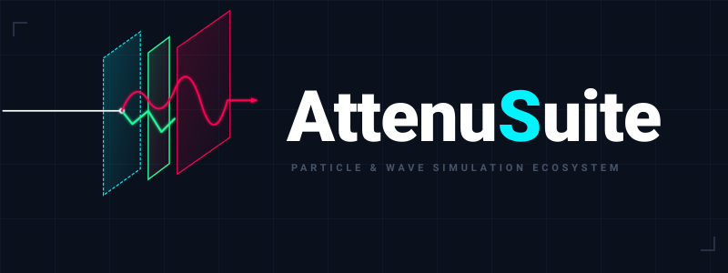

# AttenuSuite



Attenu Suite is a unified workspace hub acting as the primary launchpad for our specialized physical attenuation and particle-tracking simulation engines. Built on modern numerical methods and cloud-native visualization structures, this suite provides researchers, semiconductor engineers, and medical physicists with instant microstructural interaction insights.

---

## 🎛️ Deployed Applications

The suite currently bridges two distinct topological simulation frameworks:

### 🔬 AttenuX (Photon Attenuation & X-Ray Radiography Solver)
* **Core Physics:** Deterministic photon interaction mechanisms (Photoelectric Absorption, Compton Scattering, Rayleigh Scattering).
* **Primary Scope:** Multi-element layer shielding optimization, mass attenuation calculations ($\mu/\rho$), and transmission spectra modeling.
* **Target Industry:** Radiation shielding design, medical diagnostic imaging, and non-destructive testing (NDT).

### ⚡ AttenuE (Monte Carlo Electron Track & Dose Simulator)
* **Core Physics:** Continuous Slowing-Down Approximation (CSDA) via the Bethe stopping power equation and screened Rutherford elastic deflections.
* **Primary Scope:** High-fidelity 3D random-walk trajectory tracking, interaction volume mapping, and depth-dose profile monitoring.
* **Target Industry:** Electron-beam lithography, scanning electron microscopy (SEM) analysis, and semiconductor heterojunction profiling.

---

## 🛠️ Hub Architecture

```text
├── .streamlit/
│   └── config.toml          # Enforces global dark mode parameters across the ecosystem
├── app.py                   # Central routing hub dashboard utilizing base64 vector-mapped launchers
├── Attenu_Suite_Banner.svg # Combined particle-wave design master asset
├── AttenuX_Banner.svg       # Sister app branding file for deterministic photon logic
└── AttenuE_Logo.svg         # Sister app branding file for stochastic electron logic
